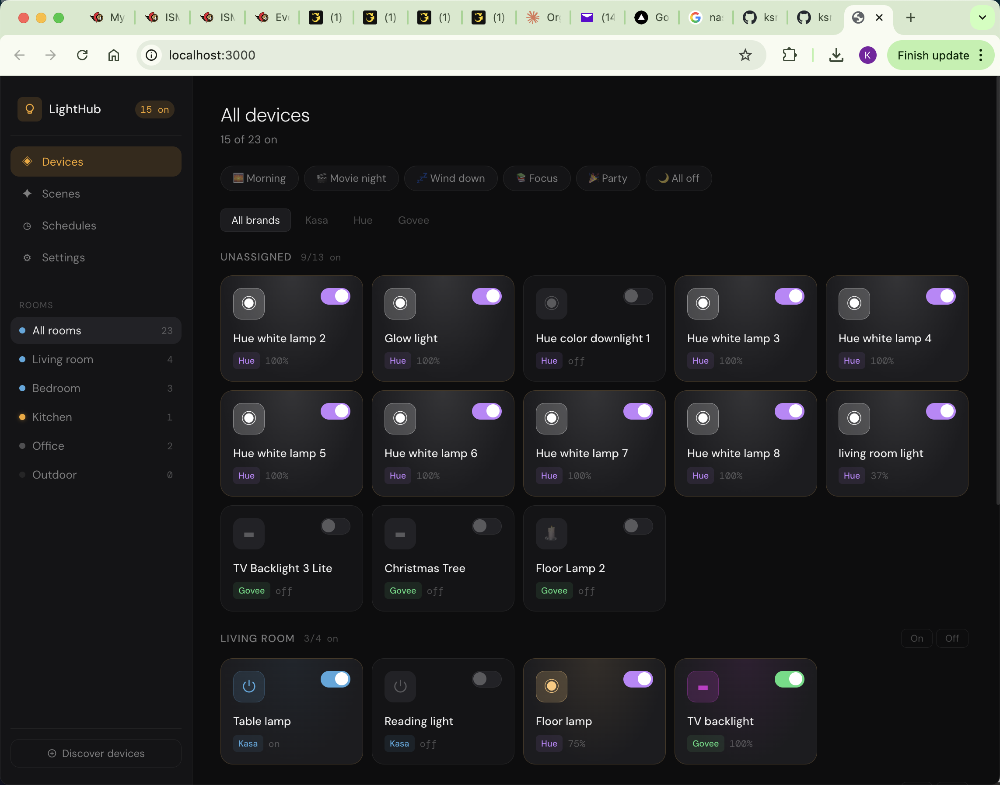

# LightHub

A unified smart home lighting dashboard for **Kasa plugs**, **Philips Hue**, and **Govee strips**.



## Project structure

```
lighthub/
├── backend/
│   ├── main.py          ← FastAPI server (all three APIs unified)
│   ├── scheduler.py     ← Schedule daemon (runs separately)
│   └── requirements.txt
└── frontend/
    ├── src/
    │   ├── pages/       ← Devices, Scenes, Schedules, Settings
    │   ├── components/  ← Sidebar, DeviceCard
    │   ├── App.jsx
    │   └── api.js
    └── package.json
```

---

## Setup

### 1 — Python backend

**Requirements**: Python 3.10+

```bash
cd backend
pip install -r requirements.txt
```

Start the server:

```bash
uvicorn main:app --reload --port 8000
```

The backend runs at http://localhost:8000. It works immediately with mock device data
even if you haven't configured any real devices yet.

---

### 2 — React frontend

**Requirements**: Node.js 18+

```bash
cd frontend
npm install
npm run dev
```

Open http://localhost:3000 in your browser.

---

### 3 — Configure your devices

Open the app and go to **Settings**.

#### Kasa (TP-Link smart plugs)
No config needed — Kasa devices are auto-discovered on your local network.
Click **Discover devices** in the sidebar while on the same Wi-Fi as your plugs.

#### Philips Hue
1. Find your Hue Bridge IP: open the Hue app → Settings → My Hue System, or check your router.
2. Paste the IP into Settings → Hue Bridge IP.
3. **Important**: Press the round link button on top of your Hue Bridge within 30 seconds of saving.

#### Govee
1. Open the Govee Home app → tap your profile → Settings → About us → Apply for API Key.
2. You'll receive the key by email within a few minutes.
3. Paste it into Settings → Govee API Key.

After configuring, click **Discover devices** in the sidebar to pull in your real lights.

---

### 4 — Schedules (optional)

Run the scheduler daemon in a separate terminal to enable time-based automations:

```bash
cd backend
python scheduler.py
```

The scheduler checks every minute and fires scenes at their configured times.

To run it automatically on Mac at startup, create a launchd plist:

```bash
# Create ~/Library/LaunchAgents/com.lighthub.scheduler.plist
# with ProgramArguments pointing to: python /path/to/backend/scheduler.py
launchctl load ~/Library/LaunchAgents/com.lighthub.scheduler.plist
```

---

## How it works

- **Kasa**: Uses `python-kasa` for local LAN control (UDP). No cloud, no latency.
- **Hue**: Uses `phue` to talk to your Hue Bridge REST API over LAN. No internet required.
- **Govee**: Uses the Govee OpenAPI (`openapi.api.govee.com`) which exposes more devices than the older v1 API. For devices that support it, LAN control is also attempted via UDP broadcast on port 4003 — this works without internet and is used automatically when available.

The backend serves a unified REST API. The React frontend talks only to the backend.
Device state (discovered lights, room assignments) is persisted to `lighthub_devices.json` so your devices appear immediately on restart without re-running discovery.

---

## Features

- **Devices**: Toggle on/off, adjust brightness, pick colors (Hue & Govee), assign to rooms
- **Friendly names**: Give any light a custom label — expand a device card and edit the Label field. Names survive re-discovery.
- **Scenes**: Save current device states as named scenes, activate with one click
- **Schedules**: Time-based scene triggers (specific time, sunrise, or sunset)
- **Room grouping**: Control all lights in a room at once
- **Brand filtering**: View just Kasa, Hue, or Govee devices
- **Persistent device state**: Discovered devices and room assignments are saved automatically — no need to re-run discovery after restarting the app
- **Govee LAN control**: If your Govee device has LAN Control enabled (Govee app → device settings → LAN Control), the app will control it locally without the cloud API
- **Govee floor lamp support**: Floor lamp models (H607C and others) are correctly identified and displayed with a distinct icon

---

## Extending

- Add new device brands by implementing discover + control functions in `main.py`
- Add automation conditions (motion, sunrise offset, etc.) in `scheduler.py`
- The `lighthub_config.json` file stores scenes, schedules, and friendly names — back it up!
- `lighthub_devices.json` stores discovered device state — safe to delete if you want a clean re-discovery
